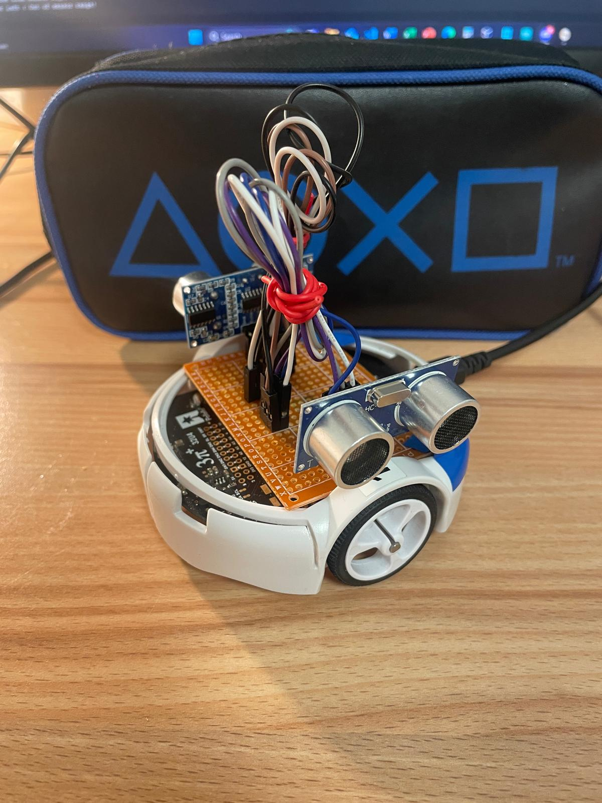

# Labyrinth Roboter

## Overview
In this project, the robot must navigate a labyrinth by driving from the starting point to the finish line. Since the labyrinth is not known in advance, the challenge is to solve it independently using sensors. The shape of the Labyrinth will not be announced until the day of the competition. 

The algorithm uses the right-hand or left-hand rule principle. Both rules are based on the idea of ​​staying along a wall to traverse the maze. At branches, corners or intersections, the robot follows the wall that is on its right or left side. Bump sensors are used to detect dead ends. When the robot reaches a dead end, it turns 90 degrees. The direction of rotation is determined by the rule used. For example, when using the right-hand rule, the robot turns to the left so that the right sensor detects the wall again. 

### Picture

## Test Results
- Left Hand Mode  : https://youtube.com/shorts/3A4vnsfljMg?feature=share
- Right Hand Mode : https://youtube.com/shorts/hvW1ITRCJbs?feature=share
